# Activity QC

## Retained cCREs and barcodes
**Goal: Assesses cCRE and BC coverage**  
**Input file: activity_per_rep** 
**Evaluated metrics: DNA Complexity, RNA Complexity**: 

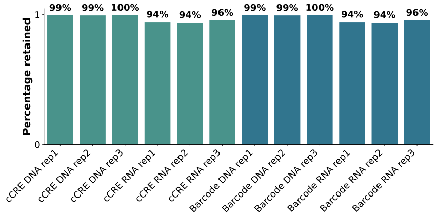

**Legend: Percentage of cCREs and BCs present in the DNA and RNA quantification data compared with those observed in the association data**  
**Interpretation:** 

## DNA counts vs GC content

**Goal: **  
**Input file: **  
**Evaluated metrics: **  

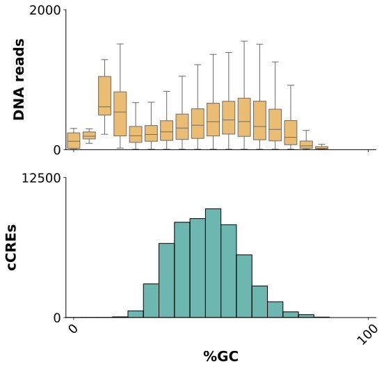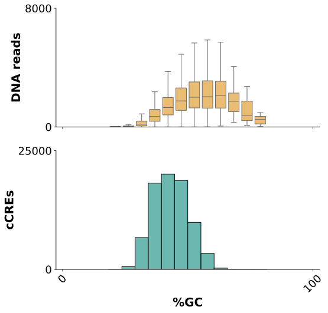

**Legend:**  
**Interpretation:** 

## Activity statistic vs count ratio

**Goal: **  
**Input file: **  
**Evaluated metrics: **  

**Legend:**  
**Interpretation:** 

## Differential activity statistic vs count ratio

**Goal: **  
**Input file: **  
**Evaluated metrics: **  

**Legend:**  
**Interpretation:** 

## Activity distribution
**Goal: Assesses activity dynamic range, noise, and statistical power**  
**Input file: quantification table (comb_df)** 
**Evaluated metrics: DNA Complexity, RNA Complexity**: 

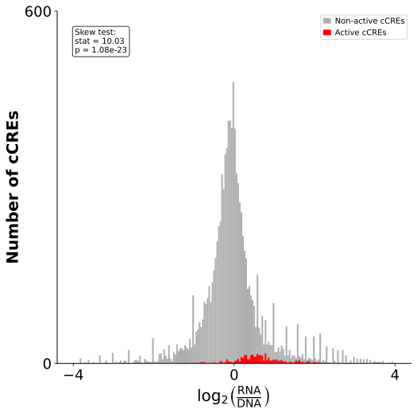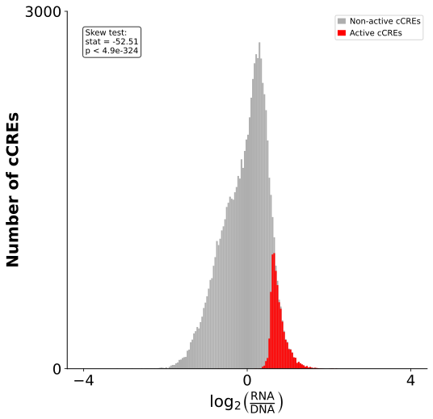
**Legend:**  
**Interpretation:** 

## Differential activity distribution

**Goal: Assesses differential activity dynamic range, noise, and statistical power**  
**Input file: comparative_df**  
**Evaluated metrics: DNA Complexity, RNA Complexity**  

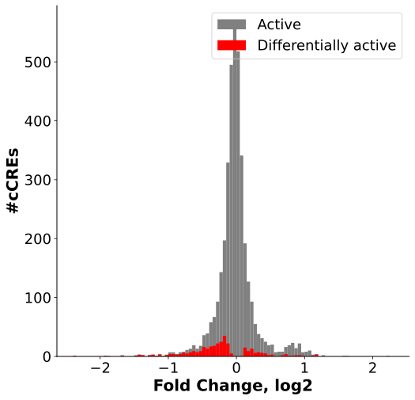

**Legend:**  
**Interpretation:** 

## P-value distribution
**Goal: Inferring the power of the statistical test**  
**Input file: quantification table (comb_df)** 
**Evaluated metrics: DNA Complexity, RNA Complexity, Reproducibility, Dynamic range**: 

**Legend:**  
**Interpretation:** 

## Volcano plot - FC vs Pval

**Goal: **  
**Input file: **  
**Evaluated metrics: **  

**Legend:**  
**Interpretation:** 

## BC retention by DNA/RNA sequencing depth

**Goal: **  
**Input file: **  
**Evaluated metrics: **  

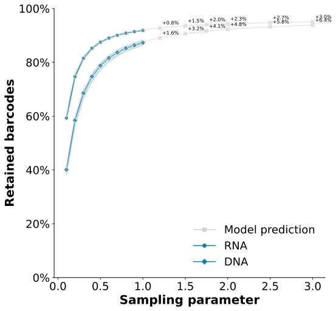

**Legend:**  
**Interpretation:** 

## cCRE retention by DNA/RNA sequencing depth

**Goal: **  
**Input file: **  
**Evaluated metrics: **  

**Legend:**  
**Interpretation:** 

## Activity by sequencing depth
**Goal: uses downsampling of sequencing reads to assess if sequencing depth is sufficient**  
**Input file: Downsampling activity data frames** 
**Evaluated metrics: DNA Complexity, RNA Complexity** 

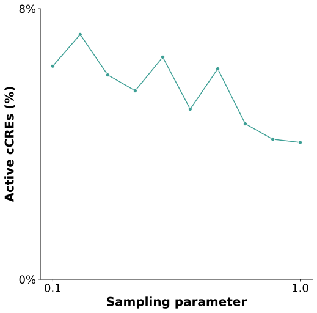
**Legend:**  
**Interpretation:** 

## Cumulative RNA reads
**Goal: assesses jackpotting**  
**Input file: quantification table (comb_df)** 
**Evaluated metrics: DNA Complexity, RNA Complexity**: 

**Legend:**  
**Interpretation:** 

## Sample clustering
**Goal: Assesses reproducibility between samples**  
**Input file: cDNA_reads_by_cell_type** 
**Evaluated metrics: Reproducibility**: 

mention in the bookdown: the importance of the percentage explained by the 1st and 2nd PCs. 

**Legend: Principal component analysis (PCA) on samples**  
**Interpretation:** 

## Correlation between replicates
**Goal: assesses reproducibility between replicates**  
**Input file: activity_per_rep** 
**Evaluated metrics: Reproducibility**: 

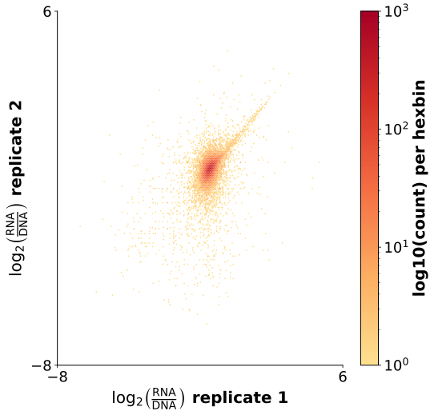
**Legend:**  
**Interpretation:** 

## Correlation of differential activity between replicates

**Goal: **  
**Input file: **  
**Evaluated metrics: **  

**Legend:**  
**Interpretation:** 

## Replicability by activity
**Goal: assesses the correlation in activity between replicates in active vs non-active cCREs**  
**Input file:** 
**Evaluated metrics: Reproducibility ** 

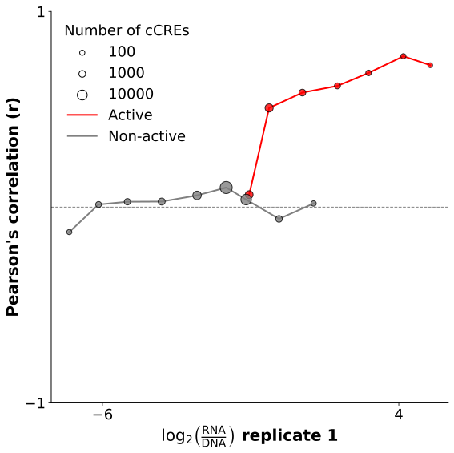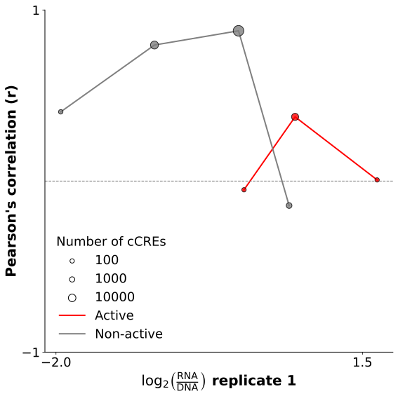
**Legend:**  
**Interpretation:** 

## Correlation between replicates (controls)
**Goal: analysis assesses reproducibility between replicates in positive and negative controls**  
**Input file: quantification table (comb_df)** 
**Evaluated metrics: Reproducibility** 

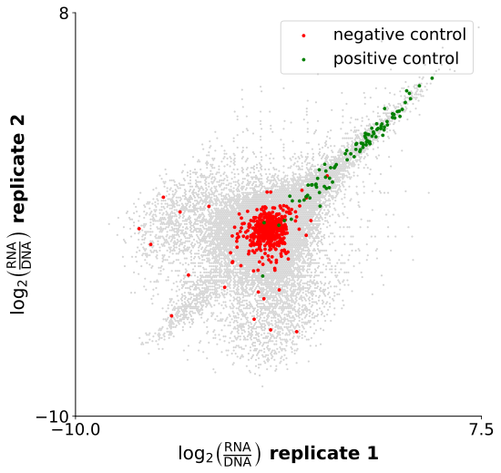
**Legend:**  
**Interpretation:** 

## Cross-validation:allelic pairs

**Goal: **  
**Input file: **  
**Evaluated metrics: **  

**Legend:**  
**Interpretation:** 

## Correlation of differential activity between overlapping sequences

**Goal: **  
**Input file: **  
**Evaluated metrics: **  

**Legend:**  
**Interpretation:** 

## Cross-validaiton: cell types

**Goal: **  
**Input file: **  
**Evaluated metrics: **  

**Legend:**  
**Interpretation:** 

## Correlation of differential activity between cell types

**Goal: **  
**Input file: **  
**Evaluated metrics: **  

**Legend:**  
**Interpretation:** 

## Cross-validation: experiments

**Goal: **  
**Input file: **  
**Evaluated metrics: **  

**Legend:**  
**Interpretation:** 

## Correlation of differential activity between experiments

**Goal: **  
**Input file: **  
**Evaluated metrics: **  

**Legend:**  
**Interpretation:** 

## Replicability across experiments

**Goal: **  
**Input file: **  
**Evaluated metrics: **  

**Legend:**  
**Interpretation:** 

## Minimizing noise 
**Goal: Removing outlier BCs and optimizing the threshold of minimum DNA counts to increase reproducibility**  
**Input file: ** 
**Evaluated metrics: Reproducibility**: 

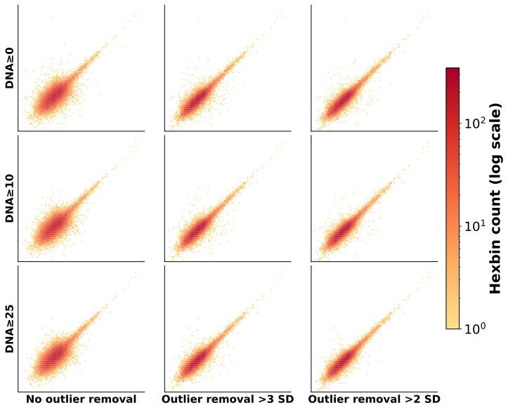
**Legend:**  
**Interpretation:** 

## Reproducibility by sequencing depth

**Goal: Assesses whether additional sequencing will improve reproducibility between replicates**  
**Input file: Activity down sampling files**  
**Evaluated metrics: Reproducibility**  

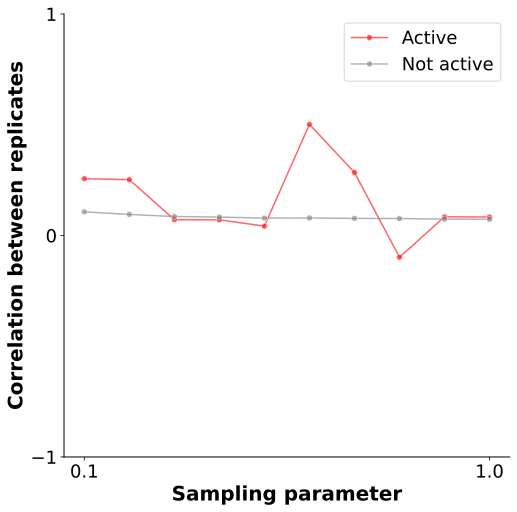

**Legend:**  
**Interpretation:** 

## RNA vs DNA
**Goal: Assesses if there is true activity in the experiment**  
**Input file:** 
**Evaluated metrics: Dynamic Range** 

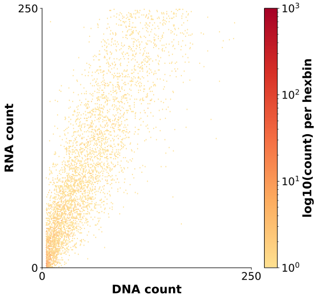

**Legend:**  
**Interpretation:** 

## Activity of controls
**Goal: assesses the dynamic range of activity**  
**Input file: quantification table (comb_df)** 
**Evaluated metrics: Dynamic Range**: 

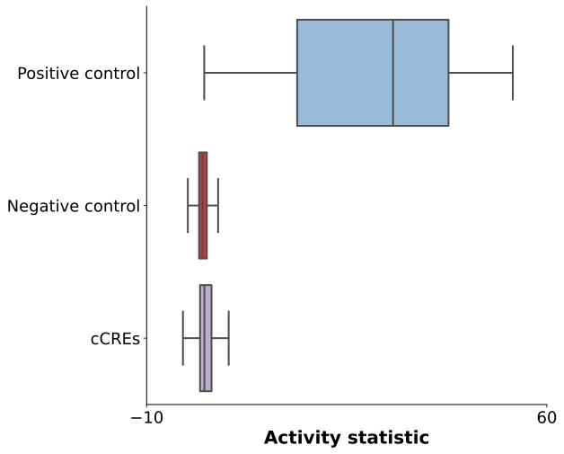
**Legend:**  
**Interpretation:** 

## Genomic annotations

**Goal: This analysis assesses concordance with endogenous signals of active chromatin marks**  
**Input file: Genomic annotation file**  
**Evaluated metrics: Dynamic Range**  

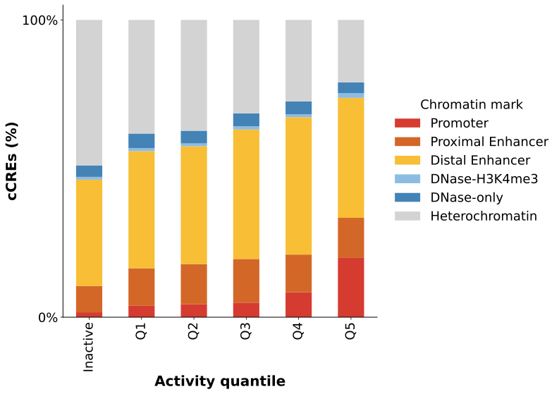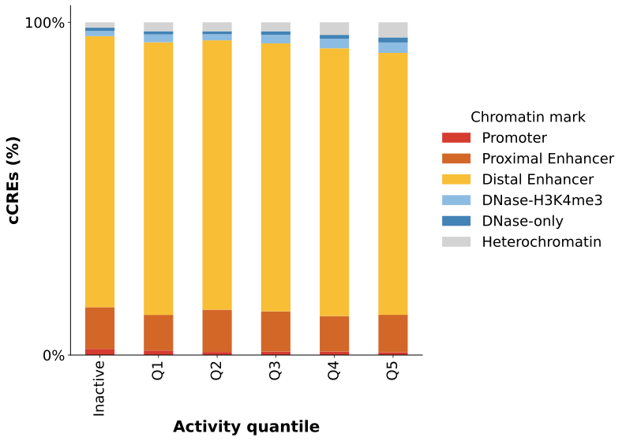

**Legend:**  
**Interpretation:** 

## Proximity to TSS

**Goal: is analysis assesses concordance with endogenous locations of cCREs**  
**Input file: Distance to TSS file**  
**Evaluated metrics: Dynamic Range**  

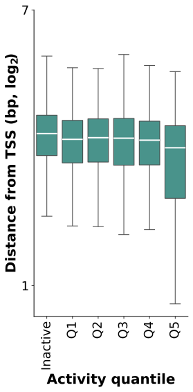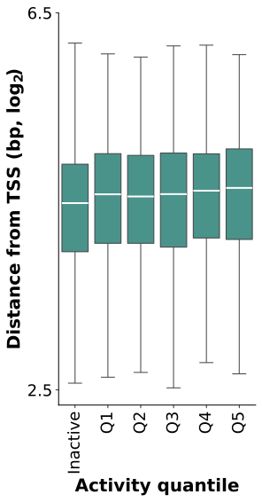

**Legend:**  
**Interpretation:** 

## AI predictions vs activity

**Goal: **  
**Input file: **  
**Evaluated metrics: **  

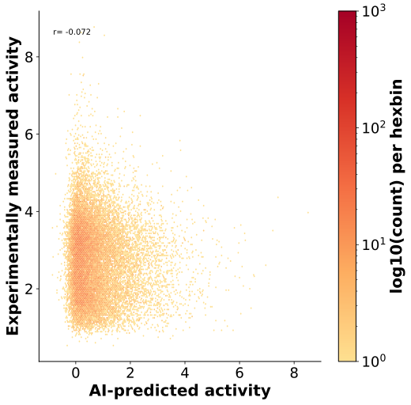

**Legend:**  
**Interpretation:** 

## AI predictions vs differential activity

**Goal: **  
**Input file: **  
**Evaluated metrics: **  

**Legend:**  
**Interpretation:** 

