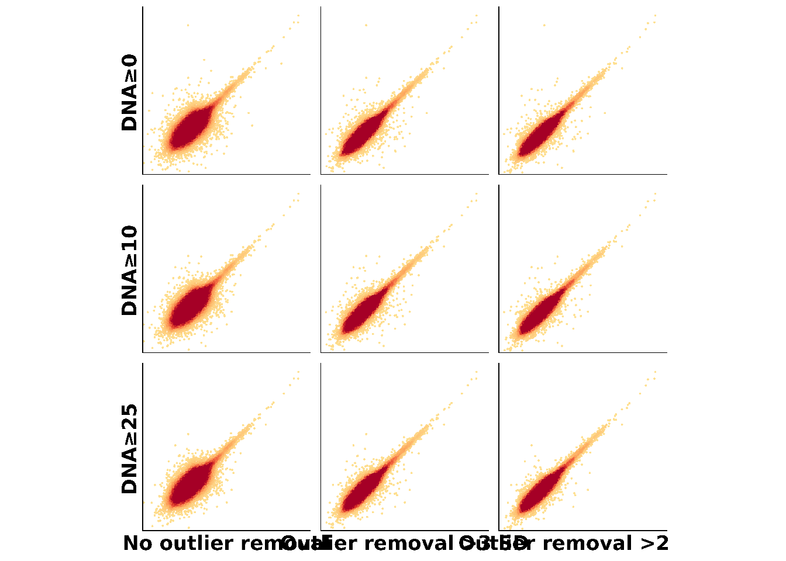

# Activity QC


## Retained cCREs and barcodes
**Goal: Assesses cCRE and BC coverage** <br>
**Input file: activity_per_rep**<br>
**Evaluated metrics: DNA Complexity, RNA Complexity**:<br>


**Legend: Percentage of cCREs and BCs present in the DNA and RNA quantification data compared with those observed in the association data** <br>
**Interpretation:**<br>


## DNA counts vs GC content

**Goal: ** <br>
**Input file: ** <br>
**Evaluated metrics: ** <br>


**Legend:** <br>
**Interpretation:**<br>

## Activity statistic vs count ratio

**Goal: ** <br>
**Input file: ** <br>
**Evaluated metrics: ** <br>


**Legend:** <br>
**Interpretation:**<br>

## Differential activity statistic vs count ratio

**Goal: ** <br>
**Input file: ** <br>
**Evaluated metrics: ** <br>


**Legend:** <br>
**Interpretation:**<br>


## Activity distribution
**Goal: Assesses activity dynamic range, noise, and statistical power** <br>
**Input file: quantification table (comb_df)**<br>
**Evaluated metrics: DNA Complexity, RNA Complexity**:<br>


```
## Good example: PMID_38766054_Reilly 
## Bad example: humanMPRA_L4a2 
## Bad example 2: humanMPRA_L1a1_Neurons
```


```
## [1] "add arrows that indicate right tail, symmetry, or no activity detected"
```
**Legend:** <br>
**Interpretation:**<br>


## Differential activity distribution

**Goal: Assesses differential activity dynamic range, noise, and statistical power** <br>
**Input file: comparative_df** <br>
**Evaluated metrics: DNA Complexity, RNA Complexity** <br>


**Legend:** <br>
**Interpretation:**<br>


## P-value distribution
**Goal: Inferring the power of the statistical test** <br>
**Input file: quantification table (comb_df)**<br>
**Evaluated metrics: DNA Complexity, RNA Complexity, Reproducibility, Dynamic range**:<br>

Problem: nothitng looks mildly bad, max looks too bad. 


```
## Good example: PMID_38766054_Reilly 
## Bad example: Max_MPRA_run2
```


**Legend:** <br>
**Interpretation:**<br>

## Volcano plot - FC vs Pval

**Goal: ** <br>
**Input file: ** <br>
**Evaluated metrics: ** <br>


**Legend:** <br>
**Interpretation:**<br>

## BC retention by DNA/RNA sequencing depth

**Goal: ** <br>
**Input file: ** <br>
**Evaluated metrics: ** <br>


**Legend:** <br>
**Interpretation:**<br>


## cCRE retention by DNA/RNA sequencing depth

**Goal: ** <br>
**Input file: ** <br>
**Evaluated metrics: ** <br>


**Legend:** <br>
**Interpretation:**<br>


## Activity by sequencing depth
**Goal: uses downsampling of sequencing reads to assess if sequencing depth is sufficient** <br>
**Input file: Downsampling activity data frames**<br>
**Evaluated metrics: DNA Complexity, RNA Complexity**<br>


**Legend:** <br>
**Interpretation:**<br>


## Cumulative RNA reads
**Goal: assesses jackpotting** <br>
**Input file: quantification table (comb_df)**<br>
**Evaluated metrics: DNA Complexity, RNA Complexity**:<br>


```
## Good example: PMID_38766054_Reilly 
## Bad example: d2Osteoblast_spiking_oligos
```


**Legend:** <br>
**Interpretation:**<br>


## Sample clustering
**Goal: Assesses reproducibility between samples** <br>
**Input file: cDNA_reads_by_cell_type**<br>
**Evaluated metrics: Reproducibility**:<br>

mention in the bookdown: the importance of the percentage explained by the 1st and 2nd PCs. 

```
## Good example: PMID_38766054_Reilly 
## Bad example: thylacine_biorxiv_Gallego_Romero
```


**Legend: Principal component analysis (PCA) on samples** <br>
**Interpretation:**<br>


## Correlation between replicates
**Goal: assesses reproducibility between replicates** <br>
**Input file: activity_per_rep**<br>
**Evaluated metrics: Reproducibility**:<br>


```
## Good example: thylacine_biorxiv_Gallego_Romero 
## Bad example: humanMPRA_L4a2
```


```
## Warning in rm(good_example_MPRA, bad_example_MPRA, bad_example_MPRA_2,
## analysis_name): object 'bad_example_MPRA_2' not found
```
**Legend:** <br>
**Interpretation:**<br>


## Correlation of differential activity between replicates

**Goal: ** <br>
**Input file: ** <br>
**Evaluated metrics: ** <br>


**Legend:** <br>
**Interpretation:**<br>


## Replicability by activity
**Goal: assesses the correlation in activity between replicates in active vs non-active cCREs** <br>
**Input file:**<br>
**Evaluated metrics: Reproducibility **<br>


```
## Good example: PMID_38766054_Reilly 
## Bad example: humanMPRA_L4a2
```


**Legend:** <br>
**Interpretation:**<br>


## Correlation between replicates (controls)
**Goal: analysis assesses reproducibility between replicates in positive and negative controls** <br>
**Input file: quantification table (comb_df)**<br>
**Evaluated metrics: Reproducibility**<br>


```
## Good example: PMID_38766054_Reilly 
## Bad example: Max_MPRA_run2
```


**Legend:** <br>
**Interpretation:**<br>


## Cross-validation:allelic pairs

**Goal: ** <br>
**Input file: ** <br>
**Evaluated metrics: ** <br>


**Legend:** <br>
**Interpretation:**<br>

## Correlation of differential activity between overlapping sequences

**Goal: ** <br>
**Input file: ** <br>
**Evaluated metrics: ** <br>


**Legend:** <br>
**Interpretation:**<br>

## Cross-validaiton: cell types

**Goal: ** <br>
**Input file: ** <br>
**Evaluated metrics: ** <br>


**Legend:** <br>
**Interpretation:**<br>

## Correlation of differential activity between cell types

**Goal: ** <br>
**Input file: ** <br>
**Evaluated metrics: ** <br>


**Legend:** <br>
**Interpretation:**<br>

## Cross-validation: experiments

**Goal: ** <br>
**Input file: ** <br>
**Evaluated metrics: ** <br>


**Legend:** <br>
**Interpretation:**<br>

## Correlation of differential activity between experiments

**Goal: ** <br>
**Input file: ** <br>
**Evaluated metrics: ** <br>


**Legend:** <br>
**Interpretation:**<br>

## Replicability across experiments

**Goal: ** <br>
**Input file: ** <br>
**Evaluated metrics: ** <br>


**Legend:** <br>
**Interpretation:**<br>


## Minimizing noise 
**Goal: Removing outlier BCs and optimizing the threshold of minimum DNA counts to increase reproducibility** <br>
**Input file: **<br>
**Evaluated metrics: Reproducibility**:<br>


```
## Good example: modern_humanMPRA_Hob 
## Bad example: NA
```


**Legend:** <br>
**Interpretation:**<br>


## Reproducibility by sequencing depth

**Goal: Assesses whether additional sequencing will improve reproducibility between replicates** <br>
**Input file: Activity down sampling files** <br>
**Evaluated metrics: Reproducibility** <br>


**Legend:** <br>
**Interpretation:**<br>


## RNA vs DNA
**Goal: Assesses if there is true activity in the experiment** <br>
**Input file:**<br>
**Evaluated metrics: Dynamic Range**<br>


```
## Good example: PMID_38766054_Reilly 
## Bad example: humanMPRA_L4a2 
## Bad example 2: humanMPRA_L1a1_Neurons
```


**Legend:** <br>
**Interpretation:**<br>


## Activity of controls
**Goal: assesses the dynamic range of activity** <br>
**Input file: quantification table (comb_df)**<br>
**Evaluated metrics: Dynamic Range**:<br>


```
## Good example: PMID_38766054_Reilly 
## Bad example: Max_MPRA_run2
```


**Legend:** <br>
**Interpretation:**<br>


## Genomic annotations

**Goal: This analysis assesses concordance with endogenous signals of active chromatin marks** <br>
**Input file: Genomic annotation file** <br>
**Evaluated metrics: Dynamic Range** <br>


**Legend:** <br>
**Interpretation:**<br>


## Endogenous genomic annotation - differential activity

**Goal: ** <br>
**Input file: ** <br>
**Evaluated metrics: ** <br>


**Legend:** <br>
**Interpretation:**<br>

## Proximity to TSS


**Goal: is analysis assesses concordance with endogenous locations of cCREs** <br>
**Input file: Distance to TSS file** <br>
**Evaluated metrics: Dynamic Range** <br>


**Legend:** <br>
**Interpretation:**<br>


## AI predictions vs activity

**Goal: ** <br>
**Input file: ** <br>
**Evaluated metrics: ** <br>


**Legend:** <br>
**Interpretation:**<br>


