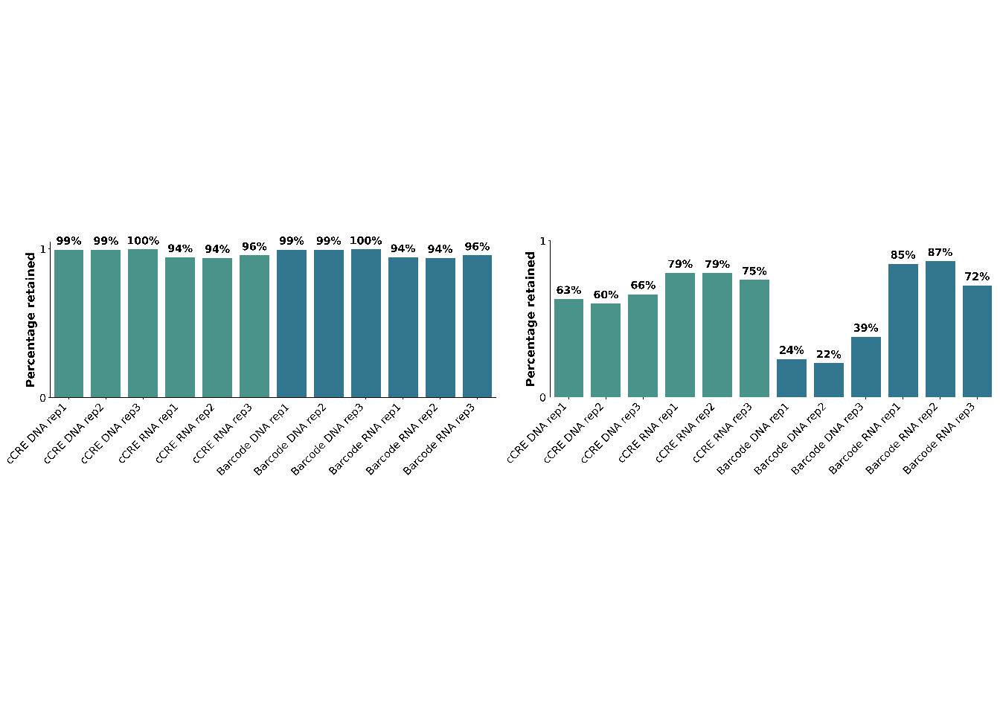
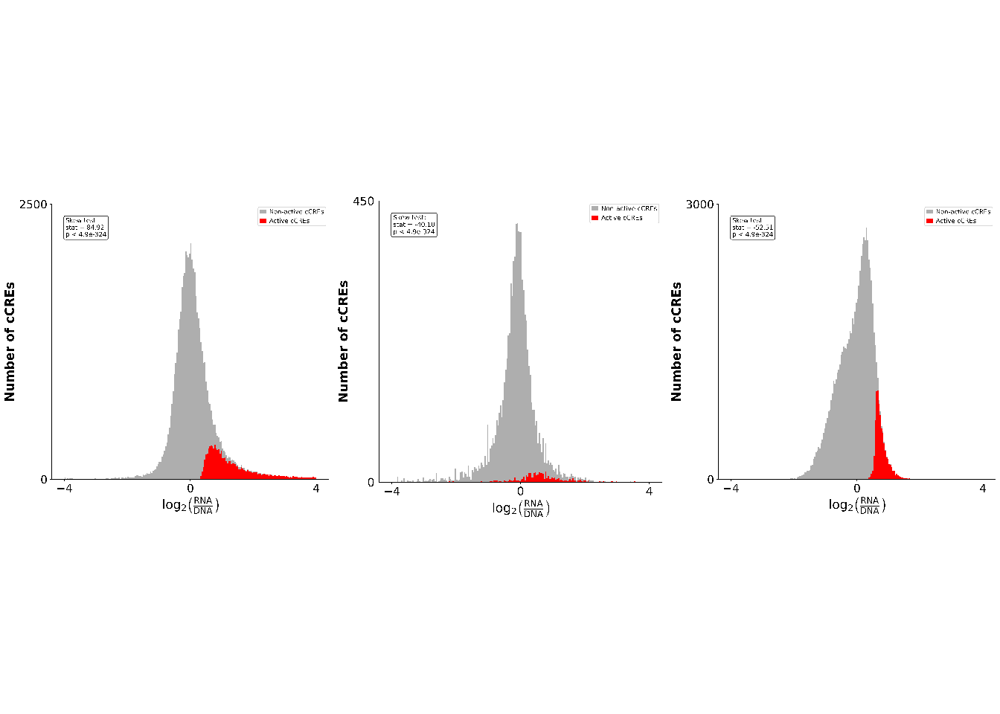
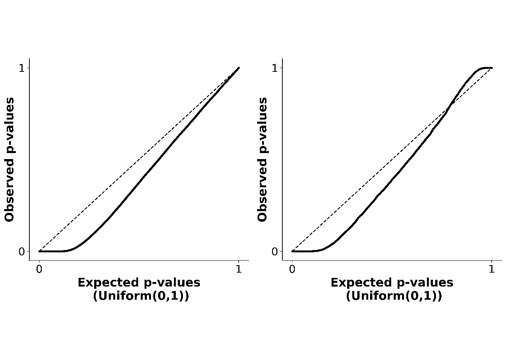
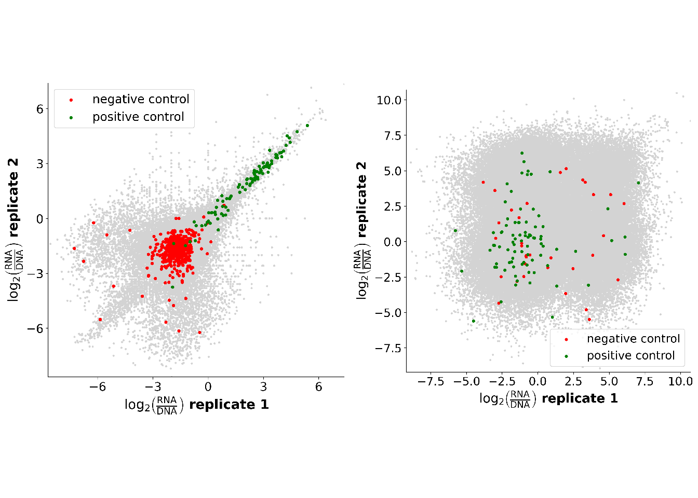
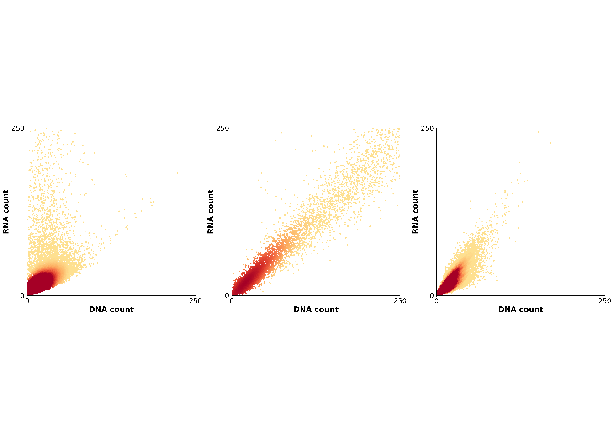

# Activity QC


## Evaluating DNA and RNA complexity
### Retained cCREs and barcodes
**Goal:** <br>
**Input file:**<br>
**Evaluated metrics**:<br>


```
## Good example: PMID_38766054_Reilly 
## Bad example: Max_MPRA_run2
```


**Legend:** <br>
**Interpretation:**<br>


### Activity distribution
**Goal:** <br>
**Input file:**<br>
**Evaluated metrics**:<br>


```
## Good example: PMID_38766054_Reilly 
## Bad example: humanMPRA_L4a2 
## Bad example 2: humanMPRA_L1a1_Neurons
```



```
## [1] "add arrows that indicate right tail, symmetry, or no activity detected"
```
**Legend:** <br>
**Interpretation:**<br>


### P-value distribution
**Goal:** <br>
**Input file:**<br>
**Evaluated metrics**:<br>

Problem: nothitng looks mildly bad, max looks too bad. 


```
## Good example: PMID_38766054_Reilly 
## Bad example: Max_MPRA_run2
```


**Legend:** <br>
**Interpretation:**<br>


### Downsampling analysis - active cCREs
**Goal:** <br>
**Input file:**<br>
**Evaluated metrics**:<br>

we should use a real downsampling - Omer is in charge of that. In the bookdown we need to mention  Max's script. 
for Max's script - we should ask why there's a jump between the last and one-before-last downsampling. send him an email. 
Also ask what does "LP complexity" mean in his script. 


**Legend:** <br>
**Interpretation:**<br>


### Cumulative RNA reads
**Goal:** <br>
**Input file:**<br>
**Evaluated metrics**:<br>


Add arrows in the x axis and below it "decreasing RNA reads" in illustrator.

```
## Good example: PMID_38766054_Reilly 
## Bad example: d2Osteoblast_spiking_oligos
```


**Legend:** <br>
**Interpretation:**<br>

### Activity by sequencing depth


**Goal: This analysis uses downsampling of sequencing reads to assess if sequencing depth is sufficient** <br>
**Input file: Activity down sampling files** <br>
**Evaluated metrics: RNA and DNA complexity** <br>


**Legend:** <br>
**Interpretation:**<br>


## Evaluating reproducibility
### Similarity between samples (PCA)
**Goal:** <br>
**Input file:**<br>
**Evaluated metrics**:<br>

mention in the bookdown: the importance of the percentage explained by the 1st and 2nd PCs. 

```
## Good example: PMID_38766054_Reilly 
## Bad example: thylacine_biorxiv_Gallego_Romero
```


**Legend:** <br>
**Interpretation:**<br>


### Correlation between replicates
**Goal:** <br>
**Input file:**<br>
**Evaluated metrics**:<br>


```
## Good example: thylacine_biorxiv_Gallego_Romero 
## Bad example: humanMPRA_L4a2
```


```
## Warning in rm(good_example_MPRA, bad_example_MPRA, bad_example_MPRA_2,
## analysis_name): object 'bad_example_MPRA_2' not found
```
**Legend:** <br>
**Interpretation:**<br>


### Variation at various activity levels
**Goal:** <br>
**Input file:**<br>
**Evaluated metrics**:<br>

Omer is in charge of this part.


```
## Good example: PMID_38766054_Reilly 
## Bad example: humanMPRA_L4a2
```


**Legend:** <br>
**Interpretation:**<br>


### Correlation between replicates (controls)
**Goal:** <br>
**Input file:**<br>
**Evaluated metrics**:<br>


```
## Good example: PMID_38766054_Reilly 
## Bad example: Max_MPRA_run2
```


**Legend:** <br>
**Interpretation:**<br>

### RNA_DNA_ratio
**Goal:** <br>
**Input file:**<br>
**Evaluated metrics**:<br>


```
## Good example: PMID_38766054_Reilly 
## Bad example: humanMPRA_L4a2 
## Bad example 2: humanMPRA_L1a1_Neurons
```


**Legend:** <br>
**Interpretation:**<br>


### Activity of controls - sample comparison
**Goal:** <br>
**Input file:**<br>
**Evaluated metrics**:<br>


```
## Good example: PMID_38766054_Reilly 
## Bad example: Max_MPRA_run2
```


**Legend:** <br>
**Interpretation:**<br>


### Minimizing noise [Outlier barcodes + min(DNA)] - use the mhMPRA data
**Goal:** <br>
**Input file:**<br>
**Evaluated metrics**:<br>


```
## Good example: modern_humanMPRA_Hob 
## Bad example: NA
```


**Legend:** <br>
**Interpretation:**<br>


### Outlier barcodes
**Goal:** <br>
**Input file:**<br>
**Evaluated metrics**:<br>


### Reproducibility by sequencing depth


**Goal: This analysis assesses whether additional sequencing will improve reproducibility between replicates** <br>
**Input file: Activity down sampling files** <br>
**Evaluated metrics: Replicability** <br>


**Legend:** <br>
**Interpretation:**<br>


### Replicability by activity


**Goal: This analysis assesses the correlation in activity between replicates in active vs non-active cCREs** <br>
**Input file: Activity file** <br>
**Evaluated metrics: Replicability** <br>


**Legend:** <br>
**Interpretation:**<br>


## Evaluating Dynamic Range


### Genomic annotations


**Goal: This analysis assesses concordance with endogenous signals of active chromatin marks** <br>
**Input file: Genomic annotation file** <br>
**Evaluated metrics: Dynamic Range** <br>


**Legend:** <br>
**Interpretation:**<br>

### Proximity to TSS


**Goal: his analysis assesses concordance with endogenous locations of cCREs** <br>
**Input file: Distance to TSS file** <br>
**Evaluated metrics: Dynamic Range** <br>


**Legend:** <br>
**Interpretation:**<br>


<!-- ############################ -->

<!-- ```{r,echo=FALSE} -->

<!-- grid.newpage() -->

<!-- good_example <- readPNG(file.path(working_dir, "humanMPRA_L3a2", "Control_activity_boxplots.png"),native = T) -->

<!-- bad_example_1 <- readPNG(file.path(working_dir, "humanMPRA_L1a1_Neurons", "Control_activity_boxplots.png"),native = T) -->
<!-- bad_example_2 <- readPNG(file.path(working_dir, "archaic_MPRA", "Control_activity_boxplots.png"),native = T) -->


<!-- # Start new page and define layout -->
<!-- grid.newpage() -->
<!-- pushViewport(viewport(layout = grid.layout(1, 3))) -->

<!-- # Helper to specify location in layout -->
<!-- vplayout <- function(row, col) viewport(layout.pos.row = row, layout.pos.col = col) -->

<!-- # Draw both images in the layout without using print() -->
<!-- pushViewport(vplayout(1, 1)) -->
<!-- grid.raster(good_example, interpolate = FALSE) -->
<!-- popViewport() -->

<!-- pushViewport(vplayout(1, 2)) -->
<!-- grid.raster(bad_example_1, interpolate = FALSE) -->
<!-- popViewport() -->

<!-- pushViewport(vplayout(1, 3)) -->
<!-- grid.raster(bad_example_2, interpolate = FALSE) -->
<!-- popViewport() -->
<!-- ``` -->

<!-- ## RNA/DNA ratio correlation between replicates - subgroup -->

<!-- Lorem Ipsum -->


<!-- ```{r,echo=FALSE} -->

<!-- grid.newpage() -->

<!-- good_example <- readPNG(file.path(working_dir,"placeholder.png"),native = T) -->
<!-- bad_example <- readPNG(file.path(working_dir,"placeholder.png"),native = T) -->


<!-- # Start new page and define layout -->
<!-- grid.newpage() -->
<!-- pushViewport(viewport(layout = grid.layout(1, 2))) -->

<!-- # Helper to specify location in layout -->
<!-- vplayout <- function(row, col) viewport(layout.pos.row = row, layout.pos.col = col) -->

<!-- # Draw both images in the layout without using print() -->
<!-- pushViewport(vplayout(1, 1)) -->
<!-- grid.raster(good_example, interpolate = FALSE) -->
<!-- popViewport() -->

<!-- pushViewport(vplayout(1, 2)) -->
<!-- grid.raster(bad_example, interpolate = FALSE) -->
<!-- popViewport() -->

<!-- ``` -->

<!-- ## RNA vs. DNA scatter plot -->

<!-- Lorem Ipsum -->


<!-- ```{r,echo=FALSE} -->

<!-- grid.newpage() -->

<!-- good_example <- readPNG(file.path(working_dir, "humanMPRA_L3a2", "RNA_DNA_ratio.png"),native = T) -->
<!-- bad_example_1 <- readPNG(file.path(working_dir, "humanMPRA_L1a1", "RNA_DNA_ratio.png"),native = T) -->
<!-- bad_example_2 <- readPNG(file.path(working_dir, "humanMPRA_L1a1_Neurons", "RNA_DNA_ratio.png"),native = T) -->


<!-- # Start new page and define layout -->
<!-- grid.newpage() -->
<!-- pushViewport(viewport(layout = grid.layout(1, 3))) -->

<!-- # Helper to specify location in layout -->
<!-- vplayout <- function(row, col) viewport(layout.pos.row = row, layout.pos.col = col) -->

<!-- # Draw both images in the layout without using print() -->
<!-- pushViewport(vplayout(1, 1)) -->
<!-- grid.raster(good_example, interpolate = FALSE) -->
<!-- popViewport() -->

<!-- pushViewport(vplayout(1, 2)) -->
<!-- grid.raster(bad_example_1, interpolate = FALSE) -->
<!-- popViewport() -->

<!-- pushViewport(vplayout(1, 3)) -->
<!-- grid.raster(bad_example_2, interpolate = FALSE) -->
<!-- popViewport() -->

<!-- ``` -->


<!-- ## RNA vs. DNA scatter plot - group of interest - Controls -->

<!-- Lorem Ipsum -->

<!-- ```{r,echo=FALSE} -->

<!-- grid.newpage() -->

<!-- good_example <- readPNG(file.path(working_dir, "humanMPRA_L3a2", "RNA_DNA_ratio_w_controls_highlighted.png"),native = T) -->
<!-- bad_example_1 <- readPNG(file.path(working_dir, "humanMPRA_L1a1", "RNA_DNA_ratio_w_controls_highlighted.png"),native = T) -->
<!-- bad_example_2 <- readPNG(file.path(working_dir, "humanMPRA_L1a1_Neurons", "RNA_DNA_ratio_w_controls_highlighted.png"),native = T) -->


<!-- # Start new page and define layout -->
<!-- grid.newpage() -->
<!-- pushViewport(viewport(layout = grid.layout(1, 3))) -->

<!-- # Helper to specify location in layout -->
<!-- vplayout <- function(row, col) viewport(layout.pos.row = row, layout.pos.col = col) -->

<!-- # Draw both images in the layout without using print() -->
<!-- pushViewport(vplayout(1, 1)) -->
<!-- grid.raster(good_example, interpolate = FALSE) -->
<!-- popViewport() -->

<!-- pushViewport(vplayout(1, 2)) -->
<!-- grid.raster(bad_example_1, interpolate = FALSE) -->
<!-- popViewport() -->

<!-- pushViewport(vplayout(1, 3)) -->
<!-- grid.raster(bad_example_2, interpolate = FALSE) -->
<!-- popViewport() -->

<!-- ``` -->


<!-- ## RNA vs. DNA scatter plot - group of interest - Active vs Non-active -->

<!-- Lorem Ipsum -->


<!-- ```{r,echo=FALSE} -->

<!-- grid.newpage() -->

<!-- good_example <- readPNG(file.path(working_dir, "humanMPRA_L3a2", "RNA_DNA_ratio_active_oligos_highlighted.png"),native = T) -->
<!-- bad_example_1 <- readPNG(file.path(working_dir, "humanMPRA_L1a1", "RNA_DNA_ratio_active_oligos_highlighted.png"),native = T) -->
<!-- bad_example_2 <- readPNG(file.path(working_dir, "humanMPRA_L1a1_Neurons", "RNA_DNA_ratio_active_oligos_highlighted.png"),native = T) -->


<!-- # Start new page and define layout -->
<!-- grid.newpage() -->
<!-- pushViewport(viewport(layout = grid.layout(1, 3))) -->

<!-- # Helper to specify location in layout -->
<!-- vplayout <- function(row, col) viewport(layout.pos.row = row, layout.pos.col = col) -->

<!-- # Draw both images in the layout without using print() -->
<!-- pushViewport(vplayout(1, 1)) -->
<!-- grid.raster(good_example, interpolate = FALSE) -->
<!-- popViewport() -->

<!-- pushViewport(vplayout(1, 2)) -->
<!-- grid.raster(bad_example_1, interpolate = FALSE) -->
<!-- popViewport() -->

<!-- pushViewport(vplayout(1, 3)) -->
<!-- grid.raster(bad_example_2, interpolate = FALSE) -->
<!-- popViewport() -->

<!-- ``` -->


<!-- ## RNA vs. DNA scatter plot - bcs level -->

<!-- Lorem Ipsum -->


<!-- ```{r,echo=FALSE} -->

<!-- grid.newpage() -->

<!-- good_example <- readPNG(file.path(working_dir,"placeholder.png"),native = T) -->
<!-- bad_example <- readPNG(file.path(working_dir,"placeholder.png"),native = T) -->

<!-- # Start new page and define layout -->
<!-- grid.newpage() -->
<!-- pushViewport(viewport(layout = grid.layout(1, 2))) -->

<!-- # Helper to specify location in layout -->
<!-- vplayout <- function(row, col) viewport(layout.pos.row = row, layout.pos.col = col) -->

<!-- # Draw both images in the layout without using print() -->
<!-- pushViewport(vplayout(1, 1)) -->
<!-- grid.raster(good_example, interpolate = FALSE) -->
<!-- popViewport() -->

<!-- # Draw both images in the layout without using print() -->
<!-- pushViewport(vplayout(1, 2)) -->
<!-- grid.raster(bad_example, interpolate = FALSE) -->
<!-- popViewport() -->

<!-- ``` -->

<!-- ## GC content bias in DNA counts -->

<!-- Lorem Ipsum -->


<!-- ```{r,echo=FALSE} -->

<!-- grid.newpage() -->

<!-- good_example <- readPNG(file.path(working_dir, "humanMPRA_L4a1", "GC_content_bias_in_DNA.png"),native = T) -->
<!-- bad_example <- readPNG(file.path(working_dir, "humanMPRA_L3a2", "GC_content_bias_in_DNA.png"),native = T) -->


<!-- # Start new page and define layout -->
<!-- grid.newpage() -->
<!-- pushViewport(viewport(layout = grid.layout(1, 2))) -->

<!-- # Helper to specify location in layout -->
<!-- vplayout <- function(row, col) viewport(layout.pos.row = row, layout.pos.col = col) -->

<!-- # Draw both images in the layout without using print() -->
<!-- pushViewport(vplayout(1, 1)) -->
<!-- grid.raster(good_example, interpolate = FALSE) -->
<!-- popViewport() -->

<!-- pushViewport(vplayout(1, 2)) -->
<!-- grid.raster(bad_example, interpolate = FALSE) -->
<!-- popViewport() -->

<!-- ``` -->

<!-- ## RNA/DNA ratio correlation between replicates -->

<!-- Lorem Ipsum -->


<!-- ```{r,echo=FALSE} -->

<!-- grid.newpage() -->

<!-- good_example <- readPNG(file.path(working_dir, "humanMPRA_L3a2", "RNA_DNA_ratio_correlation_between_replicates.png"),native = T) -->
<!-- bad_example_1 <- readPNG(file.path(working_dir, "humanMPRA_L1a1", "RNA_DNA_ratio_correlation_between_replicates.png"),native = T) -->
<!-- bad_example_2 <- readPNG(file.path(working_dir, "humanMPRA_L1a1_Neurons", "RNA_DNA_ratio_correlation_between_replicates.png"),native = T) -->


<!-- # Start new page and define layout -->
<!-- grid.newpage() -->
<!-- pushViewport(viewport(layout = grid.layout(1, 3))) -->

<!-- # Helper to specify location in layout -->
<!-- vplayout <- function(row, col) viewport(layout.pos.row = row, layout.pos.col = col) -->

<!-- # Draw both images in the layout without using print() -->
<!-- pushViewport(vplayout(1, 1)) -->
<!-- grid.raster(good_example, interpolate = FALSE) -->
<!-- popViewport() -->

<!-- pushViewport(vplayout(1, 2)) -->
<!-- grid.raster(bad_example_1, interpolate = FALSE) -->
<!-- popViewport() -->

<!-- pushViewport(vplayout(1, 3)) -->
<!-- grid.raster(bad_example_2, interpolate = FALSE) -->
<!-- popViewport() -->

<!-- ``` -->


<!-- ## RNA/DNA ratio correlation between replicates - ctrls -->

<!-- Lorem Ipsum -->


<!-- ```{r,echo=FALSE} -->

<!-- grid.newpage() -->

<!-- good_example <- readPNG(file.path(working_dir, "humanMPRA_L3a2", "RNA_DNA_ratio_correlation_between_replicates_with_controls.png"),native = T) -->
<!-- bad_example_1 <- readPNG(file.path(working_dir, "humanMPRA_L1a1", "RNA_DNA_ratio_correlation_between_replicates_with_controls.png"),native = T) -->
<!-- bad_example_2 <- readPNG(file.path(working_dir, "humanMPRA_L1a1_Neurons", "RNA_DNA_ratio_correlation_between_replicates_with_controls.png"),native = T) -->


<!-- # Start new page and define layout -->
<!-- grid.newpage() -->
<!-- pushViewport(viewport(layout = grid.layout(1, 3))) -->

<!-- # Helper to specify location in layout -->
<!-- vplayout <- function(row, col) viewport(layout.pos.row = row, layout.pos.col = col) -->

<!-- # Draw both images in the layout without using print() -->
<!-- pushViewport(vplayout(1, 1)) -->
<!-- grid.raster(good_example, interpolate = FALSE) -->
<!-- popViewport() -->

<!-- pushViewport(vplayout(1, 2)) -->
<!-- grid.raster(bad_example_1, interpolate = FALSE) -->
<!-- popViewport() -->

<!-- pushViewport(vplayout(1, 3)) -->
<!-- grid.raster(bad_example_2, interpolate = FALSE) -->
<!-- popViewport() -->

<!-- ``` -->

<!-- ## RNA/DNA ratio correlation between replicates - active vs not active -->

<!-- Lorem Ipsum -->


<!-- ```{r,echo=FALSE} -->

<!-- grid.newpage() -->

<!-- good_example <- readPNG(file.path(working_dir, "humanMPRA_L3a2", "RNA_DNA_ratio_correlation_between_replicates_with_highlighted_oligos.png"),native = T) -->
<!-- bad_example_1 <- readPNG(file.path(working_dir, "humanMPRA_L1a1", "RNA_DNA_ratio_correlation_between_replicates_with_highlighted_oligos.png"),native = T) -->
<!-- bad_example_2 <- readPNG(file.path(working_dir, "humanMPRA_L1a1_Neurons", "RNA_DNA_ratio_correlation_between_replicates_with_highlighted_oligos.png"),native = T) -->


<!-- # Start new page and define layout -->
<!-- grid.newpage() -->
<!-- pushViewport(viewport(layout = grid.layout(1, 3))) -->

<!-- # Helper to specify location in layout -->
<!-- vplayout <- function(row, col) viewport(layout.pos.row = row, layout.pos.col = col) -->

<!-- # Draw both images in the layout without using print() -->
<!-- pushViewport(vplayout(1, 1)) -->
<!-- grid.raster(good_example, interpolate = FALSE) -->
<!-- popViewport() -->

<!-- pushViewport(vplayout(1, 2)) -->
<!-- grid.raster(bad_example_1, interpolate = FALSE) -->
<!-- popViewport() -->

<!-- pushViewport(vplayout(1, 3)) -->
<!-- grid.raster(bad_example_2, interpolate = FALSE) -->
<!-- popViewport() -->

<!-- ``` -->

<!-- ## RNA/DNA ratio correlation between replicates - subgroup -->

<!-- Lorem Ipsum -->


<!-- ```{r,echo=FALSE} -->

<!-- grid.newpage() -->

<!-- good_example <- readPNG(file.path(working_dir,"placeholder.png"),native = T) -->
<!-- bad_example <- readPNG(file.path(working_dir,"placeholder.png"),native = T) -->


<!-- # Start new page and define layout -->
<!-- grid.newpage() -->
<!-- pushViewport(viewport(layout = grid.layout(1, 2))) -->

<!-- # Helper to specify location in layout -->
<!-- vplayout <- function(row, col) viewport(layout.pos.row = row, layout.pos.col = col) -->

<!-- # Draw both images in the layout without using print() -->
<!-- pushViewport(vplayout(1, 1)) -->
<!-- grid.raster(good_example, interpolate = FALSE) -->
<!-- popViewport() -->

<!-- pushViewport(vplayout(1, 2)) -->
<!-- grid.raster(bad_example, interpolate = FALSE) -->
<!-- popViewport() -->

<!-- ``` -->

<!-- ## RNA/DNA ratio correlation with previous experiments (same cell type) -->

<!-- Lorem Ipsum -->


<!-- ```{r,echo=FALSE} -->

<!-- grid.newpage() -->

<!-- good_example <- readPNG(file.path(working_dir,"placeholder.png"),native = T) -->
<!-- bad_example <- readPNG(file.path(working_dir,"placeholder.png"),native = T) -->


<!-- # Start new page and define layout -->
<!-- grid.newpage() -->
<!-- pushViewport(viewport(layout = grid.layout(1, 2))) -->

<!-- # Helper to specify location in layout -->
<!-- vplayout <- function(row, col) viewport(layout.pos.row = row, layout.pos.col = col) -->

<!-- # Draw both images in the layout without using print() -->
<!-- pushViewport(vplayout(1, 1)) -->
<!-- grid.raster(good_example, interpolate = FALSE) -->
<!-- popViewport() -->

<!-- pushViewport(vplayout(1, 2)) -->
<!-- grid.raster(bad_example, interpolate = FALSE) -->
<!-- popViewport() -->

<!-- ``` -->


<!-- ## RNA/DNA ratio correlation with previous experiments (allelic pairs) -->

<!-- Lorem Ipsum -->


<!-- ```{r,echo=FALSE} -->

<!-- grid.newpage() -->

<!-- good_example <- readPNG(file.path(working_dir,"placeholder.png"),native = T) -->
<!-- bad_example <- readPNG(file.path(working_dir,"placeholder.png"),native = T) -->


<!-- # Start new page and define layout -->
<!-- grid.newpage() -->
<!-- pushViewport(viewport(layout = grid.layout(1, 2))) -->

<!-- # Helper to specify location in layout -->
<!-- vplayout <- function(row, col) viewport(layout.pos.row = row, layout.pos.col = col) -->

<!-- # Draw both images in the layout without using print() -->
<!-- pushViewport(vplayout(1, 1)) -->
<!-- grid.raster(good_example, interpolate = FALSE) -->
<!-- popViewport() -->

<!-- pushViewport(vplayout(1, 2)) -->
<!-- grid.raster(bad_example, interpolate = FALSE) -->
<!-- popViewport() -->

<!-- ``` -->


<!-- ## RNA/DNA ratio correlation with previous experiments (allelic pairs) -->

<!-- Lorem Ipsum -->


<!-- ```{r,echo=FALSE} -->

<!-- grid.newpage() -->

<!-- good_example <- readPNG(file.path(working_dir, "humanMPRA_L3a2", "allelic_pairs_correlation.png"),native = T) -->
<!-- bad_example_1 <- readPNG(file.path(working_dir, "humanMPRA_L1a1", "allelic_pairs_correlation.png"),native = T) -->
<!-- bad_example_2 <- readPNG(file.path(working_dir, "humanMPRA_L1a1_Neurons", "allelic_pairs_correlation.png"),native = T) -->


<!-- # Start new page and define layout -->
<!-- grid.newpage() -->
<!-- pushViewport(viewport(layout = grid.layout(1, 3))) -->

<!-- # Helper to specify location in layout -->
<!-- vplayout <- function(row, col) viewport(layout.pos.row = row, layout.pos.col = col) -->

<!-- # Draw both images in the layout without using print() -->
<!-- pushViewport(vplayout(1, 1)) -->
<!-- grid.raster(good_example, interpolate = FALSE) -->
<!-- popViewport() -->

<!-- pushViewport(vplayout(1, 2)) -->
<!-- grid.raster(bad_example_1, interpolate = FALSE) -->
<!-- popViewport() -->

<!-- pushViewport(vplayout(1, 3)) -->
<!-- grid.raster(bad_example_2, interpolate = FALSE) -->
<!-- popViewport() -->

<!-- ``` -->


<!-- ## RNA/DNA ratio correlation between cell types (Ryder’s graph)Carly’s data -->

<!-- Lorem Ipsum -->


<!-- ```{r,echo=FALSE} -->

<!-- grid.newpage() -->

<!-- good_example <- readPNG(file.path(working_dir,"placeholder.png"),native = T) -->
<!-- bad_example <- readPNG(file.path(working_dir,"placeholder.png"),native = T) -->


<!-- # Start new page and define layout -->
<!-- grid.newpage() -->
<!-- pushViewport(viewport(layout = grid.layout(1, 2))) -->

<!-- # Helper to specify location in layout -->
<!-- vplayout <- function(row, col) viewport(layout.pos.row = row, layout.pos.col = col) -->

<!-- # Draw both images in the layout without using print() -->
<!-- pushViewport(vplayout(1, 1)) -->
<!-- grid.raster(good_example, interpolate = FALSE) -->
<!-- popViewport() -->

<!-- pushViewport(vplayout(1, 2)) -->
<!-- grid.raster(bad_example, interpolate = FALSE) -->
<!-- popViewport() -->

<!-- ``` -->


<!-- ## Activity statistic vs. RNA/DNA -->

<!-- Lorem Ipsum -->

<!-- ```{r,echo=FALSE} -->

<!-- grid.newpage() -->

<!-- good_example <- readPNG(file.path(working_dir, "humanMPRA_L3a2", "activity_statistic_vs_RNA_DNA_ratio.png"),native = T) -->
<!-- bad_example_1 <- readPNG(file.path(working_dir, "humanMPRA_L1a1", "activity_statistic_vs_RNA_DNA_ratio.png"),native = T) -->
<!-- bad_example_2 <- readPNG(file.path(working_dir, "humanMPRA_L1a1_Neurons", "activity_statistic_vs_RNA_DNA_ratio.png"),native = T) -->


<!-- # Start new page and define layout -->
<!-- grid.newpage() -->
<!-- pushViewport(viewport(layout = grid.layout(1, 3))) -->

<!-- # Helper to specify location in layout -->
<!-- vplayout <- function(row, col) viewport(layout.pos.row = row, layout.pos.col = col) -->

<!-- # Draw both images in the layout without using print() -->
<!-- pushViewport(vplayout(1, 1)) -->
<!-- grid.raster(good_example, interpolate = FALSE) -->
<!-- popViewport() -->

<!-- pushViewport(vplayout(1, 2)) -->
<!-- grid.raster(bad_example_1, interpolate = FALSE) -->
<!-- popViewport() -->

<!-- pushViewport(vplayout(1, 3)) -->
<!-- grid.raster(bad_example_2, interpolate = FALSE) -->
<!-- popViewport() -->

<!-- ``` -->


<!-- ## How to measure the droplet shape? -->

<!-- Lorem Ipsum -->


<!-- ```{r,echo=FALSE} -->

<!-- grid.newpage() -->

<!-- good_example <- readPNG(file.path(working_dir,"placeholder.png"),native = T) -->
<!-- bad_example <- readPNG(file.path(working_dir,"placeholder.png"),native = T) -->


<!-- # Start new page and define layout -->
<!-- grid.newpage() -->
<!-- pushViewport(viewport(layout = grid.layout(1, 2))) -->

<!-- # Helper to specify location in layout -->
<!-- vplayout <- function(row, col) viewport(layout.pos.row = row, layout.pos.col = col) -->

<!-- # Draw both images in the layout without using print() -->
<!-- pushViewport(vplayout(1, 1)) -->
<!-- grid.raster(good_example, interpolate = FALSE) -->
<!-- popViewport() -->

<!-- pushViewport(vplayout(1, 2)) -->
<!-- grid.raster(bad_example, interpolate = FALSE) -->
<!-- popViewport() -->

<!-- ``` -->


<!-- ## Increasing min(DNA) threshold to decrease noise -->

<!-- Lorem Ipsum -->


<!-- ```{r,echo=FALSE} -->

<!-- grid.newpage() -->

<!-- example <- readPNG(file.path(working_dir, "humanMPRA_L3a2", "min_DNA_threshold_noise_analysis.png"),native = T) -->


<!-- # Start new page and define layout -->
<!-- grid.newpage() -->
<!-- pushViewport(viewport(layout = grid.layout(1, 1))) -->

<!-- # Helper to specify location in layout -->
<!-- vplayout <- function(row, col) viewport(layout.pos.row = row, layout.pos.col = col) -->

<!-- # Draw both images in the layout without using print() -->
<!-- pushViewport(vplayout(1, 1)) -->
<!-- grid.raster(example, interpolate = FALSE) -->
<!-- popViewport() -->

<!-- ``` -->


<!-- ## UMI complexity -->


<!-- Lorem Ipsum -->

<!-- ```{r,echo=FALSE} -->

<!-- grid.newpage() -->

<!-- good_example <- readPNG(file.path(working_dir, "humanMPRA_L3a2", "UMI_complexity_histogram.png"),native = T) -->
<!-- bad_example <- readPNG(file.path(working_dir, "humanMPRA_L1a1", "UMI_complexity_histogram.png"),native = T) -->


<!-- # Start new page and define layout -->
<!-- grid.newpage() -->
<!-- pushViewport(viewport(layout = grid.layout(1, 2))) -->

<!-- # Helper to specify location in layout -->
<!-- vplayout <- function(row, col) viewport(layout.pos.row = row, layout.pos.col = col) -->

<!-- # Draw both images in the layout without using print() -->
<!-- pushViewport(vplayout(1, 1)) -->
<!-- grid.raster(good_example, interpolate = FALSE) -->
<!-- popViewport() -->

<!-- pushViewport(vplayout(1, 2)) -->
<!-- grid.raster(bad_example, interpolate = FALSE) -->
<!-- popViewport() -->


<!-- ``` -->


<!-- ## Activity histogram -->

<!-- Lorem Ipsum -->

<!-- ```{r,echo=FALSE} -->

<!-- grid.newpage() -->

<!-- good_example <- readPNG(file.path(working_dir, "humanMPRA_L3a2", "power_analysis_activity_histogram.png"),native = T) -->
<!-- bad_example_1 <- readPNG(file.path(working_dir, "humanMPRA_L1a1", "power_analysis_activity_histogram.png"),native = T) -->
<!-- bad_example_2 <- readPNG(file.path(working_dir, "humanMPRA_L1a1_Neurons", "power_analysis_activity_histogram.png"),native = T) -->


<!-- # Start new page and define layout -->
<!-- grid.newpage() -->
<!-- pushViewport(viewport(layout = grid.layout(1, 3))) -->

<!-- # Helper to specify location in layout -->
<!-- vplayout <- function(row, col) viewport(layout.pos.row = row, layout.pos.col = col) -->

<!-- # Draw both images in the layout without using print() -->
<!-- pushViewport(vplayout(1, 1)) -->
<!-- grid.raster(good_example, interpolate = FALSE) -->
<!-- popViewport() -->

<!-- pushViewport(vplayout(1, 2)) -->
<!-- grid.raster(bad_example_1, interpolate = FALSE) -->
<!-- popViewport() -->

<!-- pushViewport(vplayout(1, 3)) -->
<!-- grid.raster(bad_example_2, interpolate = FALSE) -->
<!-- popViewport() -->

<!-- ``` -->


<!-- ## Cumulative RNA reads -->

<!-- Lorem Ipsum -->


<!-- ```{r,echo=FALSE} -->

<!-- grid.newpage() -->

<!-- good_example <- readPNG(file.path(working_dir, "humanMPRA_L3a2", "Cumulative RNA reads.png"),native = T) -->
<!-- bad_example <- readPNG(file.path(working_dir, "methMPRA", "Cumulative RNA reads.png"),native = T) -->


<!-- # Start new page and define layout -->
<!-- grid.newpage() -->
<!-- pushViewport(viewport(layout = grid.layout(1, 2))) -->

<!-- # Helper to specify location in layout -->
<!-- vplayout <- function(row, col) viewport(layout.pos.row = row, layout.pos.col = col) -->

<!-- # Draw both images in the layout without using print() -->
<!-- pushViewport(vplayout(1, 1)) -->
<!-- grid.raster(good_example, interpolate = FALSE) -->
<!-- popViewport() -->

<!-- pushViewport(vplayout(1, 2)) -->
<!-- grid.raster(bad_example, interpolate = FALSE) -->
<!-- popViewport() -->

<!-- ``` -->


