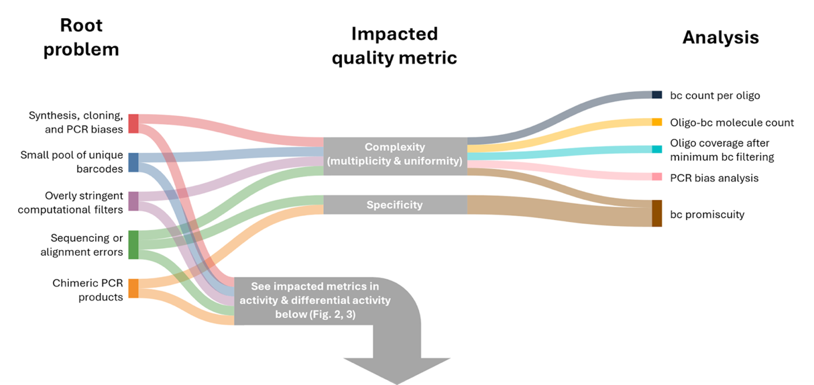
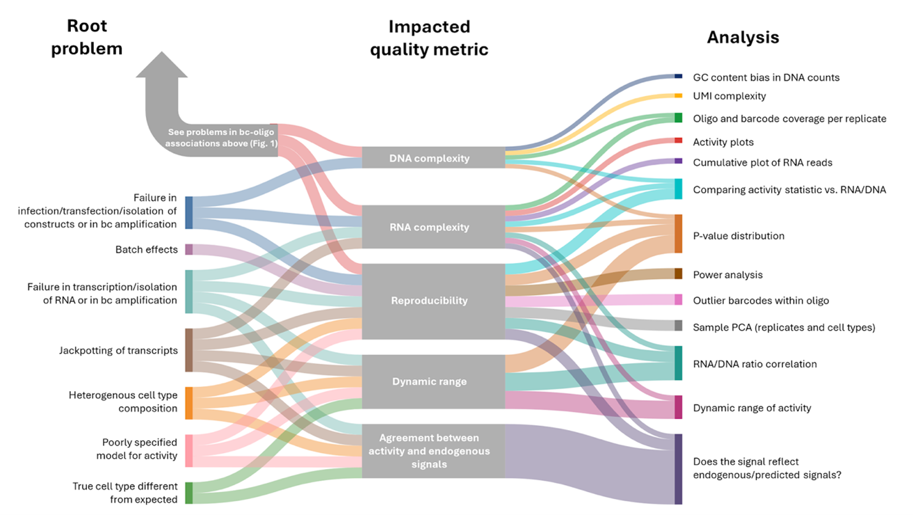

--- 
title: "Quality Control Pipeline for Massively Parallel Reporter Assays (MPRAs)"
author: "Omer Ronen"
date: "2025-11-07"
site: bookdown::bookdown_site
documentclass: book
bibliography: [book.bib, packages.bib]
# url: your book url like https://bookdown.org/yihui/bookdown
# cover-image: path to the social sharing image like images/cover.jpg
description: |
  This is a minimal example of using the bookdown package to write a book.
  The HTML output format for this example is bookdown::gitbook,
  set in the _output.yml file.
link-citations: yes
github-repo: rstudio/bookdown-demo
---

# Overview {-}

This pipeline is designed to help investigators evaluate the quality of their MPRA, quickly identify pitfalls, trace them to their source, and mitigate them. The scripts provided help ensure that the resulting MPRA data are suitable for robust statistical analysis and meaningful biological interpretation.
This Bookdown accompanies our guide for best practices for MPRAs, which outlines recommendations for study design and interpretation [REF]. The manuscript covers all key experimental and analytical steps, including library design, and estimation of activity differential activity. It then describes core problems that often compromise MPRA quality, illustrating how these issues manifest in the data, and offering practical strategies for correction and optimization.
Because each issue can influence multiple quality metrics, and each metric may be affected by several issues, the relationships form a many-to-many network. The figures presented below map these interdependencies and connect them to recommended diagnostic analyses. 

## Usage {-}

A scheme of root problems, the impacted quality metrics and analyses for the cCRE-barcode association step.

Root problems, impacted quality metrics and recommended analyses for the RNA and DNA quantification step.

The quality control (QC) pipeline is organized into three chapters:

- (i) QC of the barcode association step  
- (ii) QC of activity estimation  
- (iii) QC of differential activity estimation  

For each analysis, we provide an example of a successful and an unsuccessful dataset to illustrate how they manifest in the analysis.

We welcome questions, feedback, or suggestions. Please feel free to reach out at david.gokhman [at] weizmann.ac.il.

## Scripts {-}
All of these analyses are integrated into the quality control pipeline described in this resource, with scripts provided here: [link].

